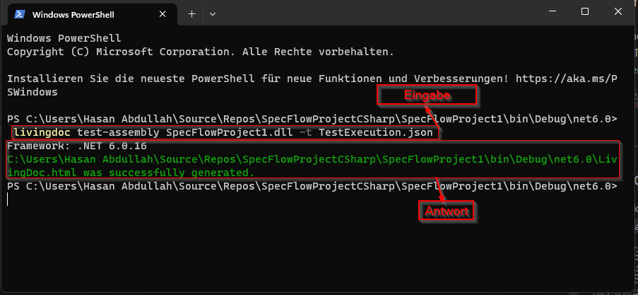
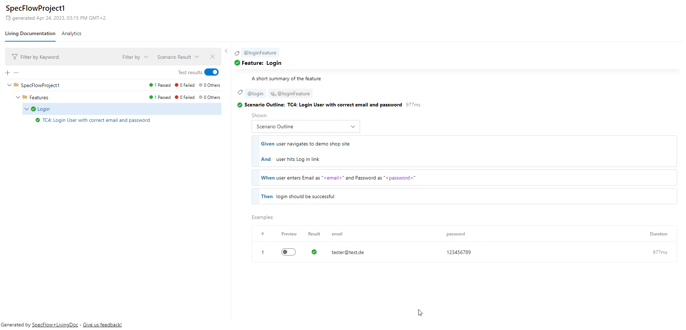

# Specflow BDD (cucumber) mit C# 

## **Projekt umgebung vorbereiten**
1. IDE: Das Projekt sollte am besten in Visual Studio2022 bearbeitet werden.

2. Extention: Installation der `Extention von Specflow` des Projekts in Menüliste unter Extention dann manage Extention klicken 

3. Dependencies: unter Dependencies im Solution Explorer Fenster mit der rechten Maustaste klicken, Menüliste erscheint, dann auf Manage NuGet Packages klicken, damit öffnet sich ein Fenster zum Hinzufügen der Dependencies.

## **Aufbau des Projekts**
1. `Feature Ordner`: der besteht aus feature Datei, wo die Szenarien geschrieben werden. 

2. `Hooks Ordner`: der besteht aus folgenden Klassen:

      - Hooks1: hier ist die Logik der drivers geschrieben.
      - Ulit: Hier ist eine Methode für das Einlesen der Json-Datei programmiert, so dass der Browsertyp aus der Datei BrowserConfig.json eingestellt werden kann.

3. `Pages Ordner`: hier sind peges nach POM-Pernzip programmiert.

4. `StepDefinitions Ordner`: Hier sind die Steps der Feature implementiert.

5. `BrowserConfig Datei`: Hier wird der browser eingegeben.

## **Das Modellprojekt anwenden**

Das Projekt enthält Demo-Test, der nach dem Aufbau mit dem POM-Prinzip und ohne Fehler oder Warnungen funktioniert.

1. Erstellung von feature Datei: im Solution Explorer Fenster auf Feature Ordner mit der rechten Maustaste klicken, Menüliste erscheint, dann add => New Item.. => weiter mit folgenen Bild:

2. Erstellung Page Klasse: nach POM-Prinzip wie folgt:

3. Erstellung StepDefinitions: dies kann ganz einfach von feature Datei generiert werden.
innerhalb der feature Datei mit der rechten Maustaste klicken, Menüliste erscheint => Define Steps... dann erscheint Define Steps Fenster => create

der neu generierter StepDefinition Datei sieht wie folgt aus:

sehr wichtig es soll am Anfang driver installiert und der konstruktor auch damit der driver in dieser Klasse übernommen werden kann. sehe "LoginStepDefinitions" 

## **run im Test Explorer Fenster**
zum öffnen `Test Explorer` Fenster klicken Strg+E+T oder von der menüliste von Test 
Ausführen des Tests wie folgt:

### **run in CMD**
der test kann mit dem Befehl `dotnet test --filter Category=tag` ausgeführt werden, wobei `tag` kann je nach scenario angepasst werden.

## **Report Grenieren**
- Am anfang muss in CMD der Befehl `dotnet tool install --global SpecFlow.Plus.LivingDoc.CLI` ausgeführt werden.

- in Projekt Ordner soll der bin ordner dann Debug dann net6.0 geöffnet werden.
dann CMD öffnen und Eingeben den Befehl `livingdoc test-assembly SpecFlowProject1.dll -t TestExecution.json`, wobei `SpecFlowProject1.dll` soll je nach Projektsname geändert werden.
 in folgenden Bild ist die in CMD erwartete Antwort.

danach wird ein HTML-Report mit dem Name `LivingDoc.html` im net6.0 Ordner Grenieriert werden.

